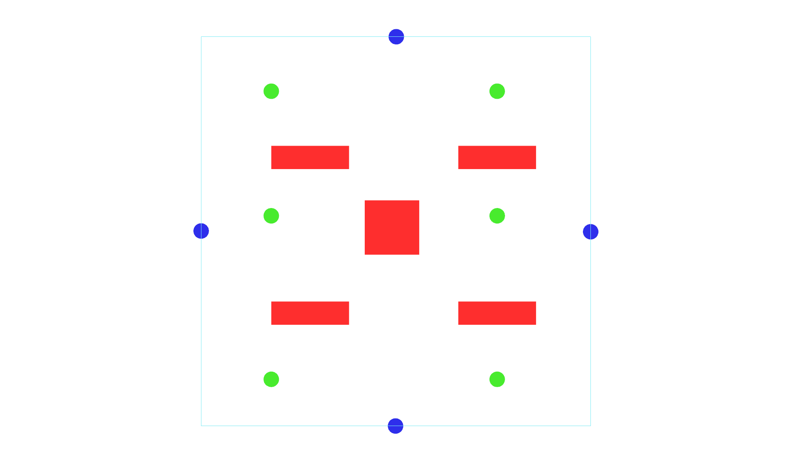
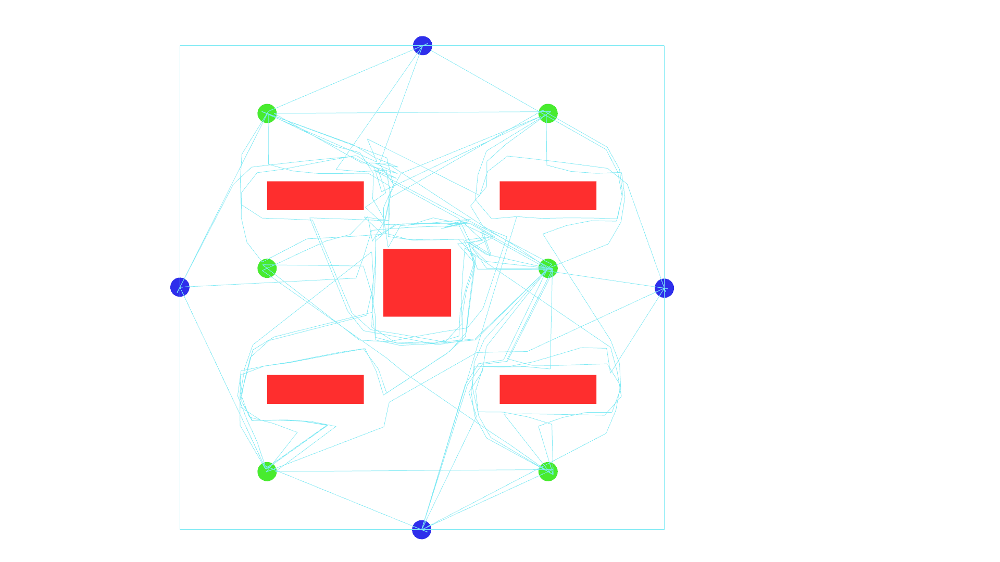
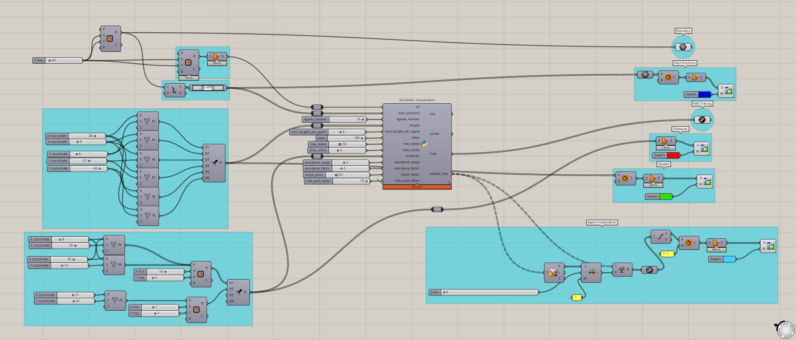

# Assignment 4: Agent-Based Model Documentation

## Table of Contents

- [Pseudo-Code](#pseudo-code)
- [Technical Explanation](#technical-explanation)
- [Design Variations](#design-variations)
- [Challenges and Solutions](#challenges-and-solutions)
- [References](#references)

---

## Pseudo-Code

1. **Main Simulation Loop**

   - **Initialize Agents**:
     - Create instances of the Agent class with initial start positions, possible targets and agent speed & agent number.
   - **Simulation Steps**:
     - For each time step:
       - **Agent Interactions**:
         - Agents interact with Targets & obstacles in the environment.
       - **Agent Movement**:
         - Agents update their positions based on their velocities.
       - **Agent Target Updates**:
         - Agents updates their targets.
       - **Agent State Updates**:
         - Agents updates their attributes.
       - **Data Collection**:
         - Record agent positions, path, targets & directions.

2. **Agent Class**

   - **Attributes**:
     - position: The agent's position in space.
     - velocity: The agent's velocity vector.
     - srf: The agent's boundary surface
     - avoidance_direction: Keeps track of which direction an agent has taken to go around an obstacle

   - **Methods**:
     - **Distance**:
       - Calculates distance between agent & target.
     - **Move**:
       - Moves the agent by adding velocity to position.
       - May include calculating forces, changing direction, or altering state.
     - **Seek_target**:
       - Checks if distance > 0, then go towards target at max speed.
       - Also checks if distance < slow_radius, then it lowers agent speed.
     - **avoid_obstacles**
       - Converts input Rectangle3D to readable curves
       - Checks if an agent is within obstacle avoidance range. if true it will repel the agent away from & push it tangentially away from the obstacle.
       - When an agent is being repelled, it will randomly chose either left or right and using the avoidance_direction attribute, the agent will keep this 
         direction while within the extended avoidance radius.
       - When an agent leaves the extended avoidance range, the direction attribute is reset to None. 
       - Added Minimum, Maximum agent speed & a forward boost, to avoid agent stalling during loops. 

---

## Technical Explanation

*(Provide a concise explanation of your code, focusing on how you implemented OOP principles and agent-based modeling. Discuss how your approach generates the final structural patterns and the mathematical or computational principles involved.)*

### Topics to Cover:

- **Object-Oriented Design**

  - Explain the classes you designed and why.
  - Discuss how you applied OOP principles like encapsulation, inheritance, and polymorphism.
  - Describe how the classes interact within the simulation.

- **Agent Behaviors and Interactions**

  - The main goal for an agent is to reach it's targets. 
    It will start from a start position and get a list of x randomly chosen targets from the targets input, which populate the input surface. These targets are put in a list, so the agent will seek them out after eachother. The agent checks if the distance between the agent position and the target position is within a threshold and will then continue to the next target. After all targets on the list have been reached, the agent will return to its start position and be finished.

  - The agents doesn't have any interations between eachother, but they do react to the environment, in this case obstacles placed inside the boundary. The way the agents interact 
    with the obstacles is by checking if they are within an avoidance range of the obstacle. It does this by converting the input obstacle (Rectangle3D) and using closestpoint, checks the distance between the agent and the obstacle. If the agent is within this range and stays within an extended avoidance range, it will try and go around the obstacle. It does this by a combination of being repelled away backwards from the obstacle and pushed sideways. This is calculated by having the vector between the agent and the closest point being the repelling force and the tangentvector being the side push. this makes the agent encounter an obstacle and then go around it by following along its edge. 

  - There is a decision making process, which happens when the agent has to go around an obstacle. The decision lies in wether to go left or right around it. 
    This is also where the 2 different ranges (avoidance & extended) plays a role. Because the agent will decide randomly between going left or right (1/-1), this is then multiplied to the tangent vector. While the agent is still within the avoidance range and will remember this decision for as long as it keeps within the extended range. Once it goes outside the extended range the decision attribute will be reset to None, until next encounter with an obstacle.

- **Simulation Loop**

  - While the simulation is running the agents have a few things they check each step
    - Reached target: The agent will check wether it is within a tolerance range of its target, if reached it will then seek out the next target on the list. 
    - Reached all targets: If all target have been reached the agent will seek out its start position. When reached the agent will stop being a part of the simulation
    - Obstacle avoidance range: The agent will check if it has encountered an obstacle, if true, it will then choose a direction and be repelled follow this direction while 
      within the extended range.
    - Obstacle extended range: The agent will check if it is still within the extended range. while true it will keep following the obstacle edge to go around the obstacle. 
      When it goes outside the range, it will reset the direction decision and go towards its intended target.   
  - Limititations
    - With the current avoidance logic, it is rather limited which geometry can be obstacles, as it relies on the tanget to push the agent around the obstacle
      - Corners will produce a circular path for the agent, in which it will keep going into the wall, be repelled back, and the go back into the wall.
      - more freeform shapes would also have to be accounted for by having the tangent be updated each iteration, compared to tracking the same direction until the agent 
        is outside the affected range.
    - If the agent speed is to great or small. 
      - If the agent speed is to great, the agent will simply go through obstacles, since it will go over the avoidance range.
      - If the agent speed is to low, the agent can stall, if it gets repelled more backwards, instead of to the side. Mening it will lose a bit of speed over each iteration,
        which will stack and end with agent having no travel distance at all.

- **Visualization**

  - The agent data is stored for each step in the simulation in a flattened list of lines. These lines show the agents path tracing 
  - These lines are then sorted into a nested list which corresponds so each sublist has the lines from a step. This can be connected to the Tree Branch component, so each step 
    in the simulation can be viewed and extracted to compile a Gif.
  - Visualization techniques
    - Using grasshopper innate visualization components, it is possible to visualize both the agents and the path they have travelled, just from the list of lines and the nested list of lines.
      - For the agents, start positions & targets, creating circles on the points which can be colored by custom preview.
      - For the Obstacles, creating surfaces from the rectangles which can be colored by custom preview.

---

## Design Visualization

1. **Visualization 1: [Simulation_GIF]**

   
   
   

   - **Parameters Changed**:
     - srf: [Surface]
     - start_position: [Points]
     - agents_number: [10]
     - targets: [Points]
     - num_targets_per_agent: [3]
     - steps: [100]
     - max_speed: [2.6]
     - slow_radius: [2]
     - obstacles: [Rectangle3D]
     - avoidance_range: [3]
     - avoidance_factor: [2]
     - boost_factor: [0.2]
     - side_psh_factor: [10]
     
   - **Description**:
     - A gif of the simulation
     - An image of the path tracing for the agents
     - An image of the grasshopper canvas, to show both how some of the geometric inputs and outputs were made. 

---

## Challenges and Solutions

*(Discuss any challenges you faced during the assignment and how you overcame them.)*

### Examples:

- **Challenge 1**: Managing large numbers of agents efficiently.
  - **Solution**: Implemented spatial partitioning to reduce computation time.

- **Challenge 2**: Agents getting stuck or clustering unnaturally.
  - **Solution**: Adjusted interaction rules and added collision avoidance behaviors.

- **Challenge 3**: Visualizing the simulation in real-time.
  - **Solution**: Used efficient data structures and optimized rendering techniques.

---

## References

*(List any resources you used or found helpful during the assignment.)*

- **Object-Oriented Programming**

  - [Python Official Documentation](https://docs.python.org/3/tutorial/classes.html)
  - [Real Python - OOP in Python](https://realpython.com/python3-object-oriented-programming/)

- **Agent-Based Modeling**

  - [Mesa: Agent-Based Modeling in Python](https://mesa.readthedocs.io/en/master/)
  - [Agent-Based Models in Architecture](https://www.researchgate.net/publication/279218265_Agent-based_models_in_architecture_new_possibilities_of_interscalar_design)

---

*(Feel free to expand upon these sections to fully capture your work and learning process.)*

---